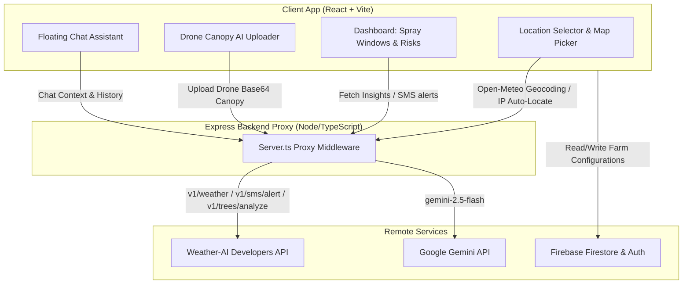

# FarmGuard AI 🌾🌦️

FarmGuard AI is a premium, smart agricultural intelligence platform that translates complex meteorological telemetry and drone imagery into immediate, actionable farming advice. By bridging the gap between weather models and crop protection strategies, FarmGuard AI helps farmers optimize their spray windows, monitor canopy health, and safeguard their yields.

---

## 🏗️ Architecture Flow



---

## ✨ Features Built

### 1. 🔐 Multi-Tiered Access & Authentication
- **Firebase Auth Support**: Fully secure login and signup system using Firebase Authentication.
- **Guest / Demo Mode**: Enables instant dashboard exploration with high-fidelity simulated database and configuration endpoints for previewing features.

### 2. 🗺️ Intelligent Farm Registration & Location Selector
- **Interactive Leaflet Map**: Drop physical location pins on a detailed map interface.
- **Reverse Geocoding**: Automatically resolves dropped pins into exact village, town, and country names using OpenStreetMap Nominatim.
- **Auto-IP Locator**: Instant auto-location detection fallback via client IP to lat/long coordinates.
- **Crop Customization**: Allows farmers to assign primary crops (e.g., Maize, Wheat, Beans, Coffee, Tea, Tomatoes, Potatoes) to individual plots.

### 3. 🌦️ Smart Microclimate Weather Dashboard
- **Dynamic Adaptive Backgrounds**: Visual interface dynamically loads tailored high-resolution cover graphics and premium glassmorphic gradient overlays matching active conditions (Clear, Clouds, Wind, Storm, Rain, Snow, Night).
- **Overview Timeline**: Breaks down forecast conditions into Morning, Afternoon, Evening, and Night segments showing exact temperature, precipitation, and wind speeds.

### 4. 🛩️ Drone & Canopy AI Analysis (Computer Vision)
- **Image Upload Integration**: Seamlessly upload smartphone or drone photos of crop paddocks.
- **AI Health Scanning**: Interacts with the Weather-AI tree analysis service (`/v1/trees/analyze`) to calculate tree counts, identify canopy density, and return a granular health breakdown (Healthy, Heat Stressed, or Diseased percentages) with practical agronomic observations.

### 5. 🌬️ Spraying & Harvesting Windows
- **Forecast Feasibility Calculator**: Scans hourly telemetry for the next 8 hours to evaluate ideal application conditions:
  - **Ideal Range**: Temperature between 15°C – 30°C, wind speed under 15 km/h, and precipitation probability below 30%.
  - **Visual Indicators**: Renders clear hourly timelines marked **Ideal** (Safe to spray/harvest) or **Avoid** (Risk of drift, evaporation, or wash-off).

### 6. 🚨 Risk Management & Notification Center
- **5-Point Matrix Check**: Monitors risk warnings for Rain, Floods, Heat Stress, Wind Damage, and Disease triggers.
- **Test SMS Alerts**: Mocked endpoint simulating live high-risk Weather-AI alerts sent directly to registered mobile numbers.
- **Pro Webhook Subscription**: Interface demonstrating real-time webhooks for frost, heavy rain, or high wind pushes.

### 7. 💬 Integrated Agronomist AI Chat
- **Floating Modal Assistant**: An interactive floating chat drawer available throughout the dashboard.
- **Contextual Awareness**: Feeds the current weather data and crop type into the backend LLM orchestrator (`gemini-2.5-flash`) to deliver highly tailored, contextual agricultural answers.

---

## 🛠️ Technology Stack

- **Frontend**: React 19, Vite, TypeScript, Tailwind CSS (v4), Framer Motion (animations), Recharts (data visualizations), Leaflet.js (maps).
- **Backend**: Node.js, Express, TSX, Google GenAI SDK.
- **Database / Auth**: Firebase Firestore & Firebase Auth.

---

## 🔑 Environment Variables Setup

Create a `.env` file in the root directory:

```env
# Server Configuration
PORT=3000

# API Keys
WEATHER_AI_API_KEY=your_weather_ai_api_key
GEMINI_API_KEY=your_gemini_api_key

# Firebase Client Configuration (Optional - fallback to simulated state in Demo mode)
VITE_FIREBASE_API_KEY=your_fb_api_key
VITE_FIREBASE_AUTH_DOMAIN=your_fb_auth_domain
VITE_FIREBASE_PROJECT_ID=your_fb_project_id
VITE_FIREBASE_STORAGE_BUCKET=your_fb_storage_bucket
VITE_FIREBASE_MESSAGING_SENDER_ID=your_fb_messaging_id
VITE_FIREBASE_APP_ID=your_fb_app_id
```

---

## 🚀 Getting Started

### 1. Install Dependencies
```bash
npm install
```

### 2. Run Development Server
The development script launches the Express backend proxy on port `3000` and configures Vite middleware to handle local client-side assets and hot reloading.
```bash
npm run dev
```

### 3. Build & Run in Production
To build static production bundles for both client React app and Node.js proxy server:
```bash
npm run build
npm run start
```
Your application will be live at `http://localhost:3000`.
